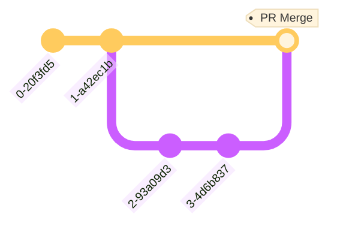

# Project Portfolio
Test commit

## Images aspect ratio

For the several images in the app apart from the profile picture, utilize `1:2.6` aspect ratio. To comply with it, following image dimensions are recommended:

* Height: 12.7 [cm]
* Width: 33 [cm]

## CI/CD

All work should be done in the `dev` branch, followed by a pull request to `main`. 

On merge to `main`, a GitHub Action updates the storage bucket for the main application, in accordance with the following architecture:

## References

* [Íconos de Bootstrap](https://icons.getbootstrap.com/)
* [Generador de fotos de perfil](https://picofme.io/)
